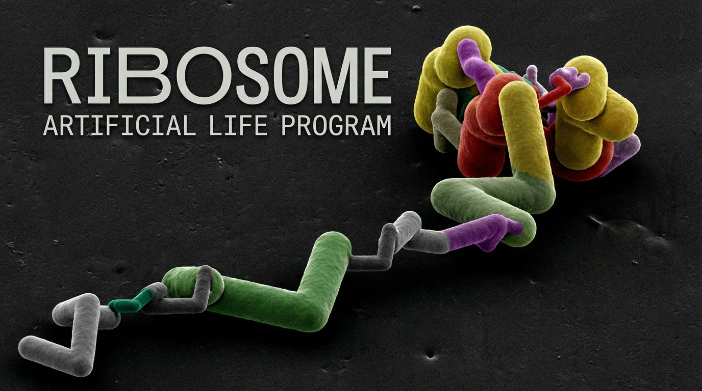
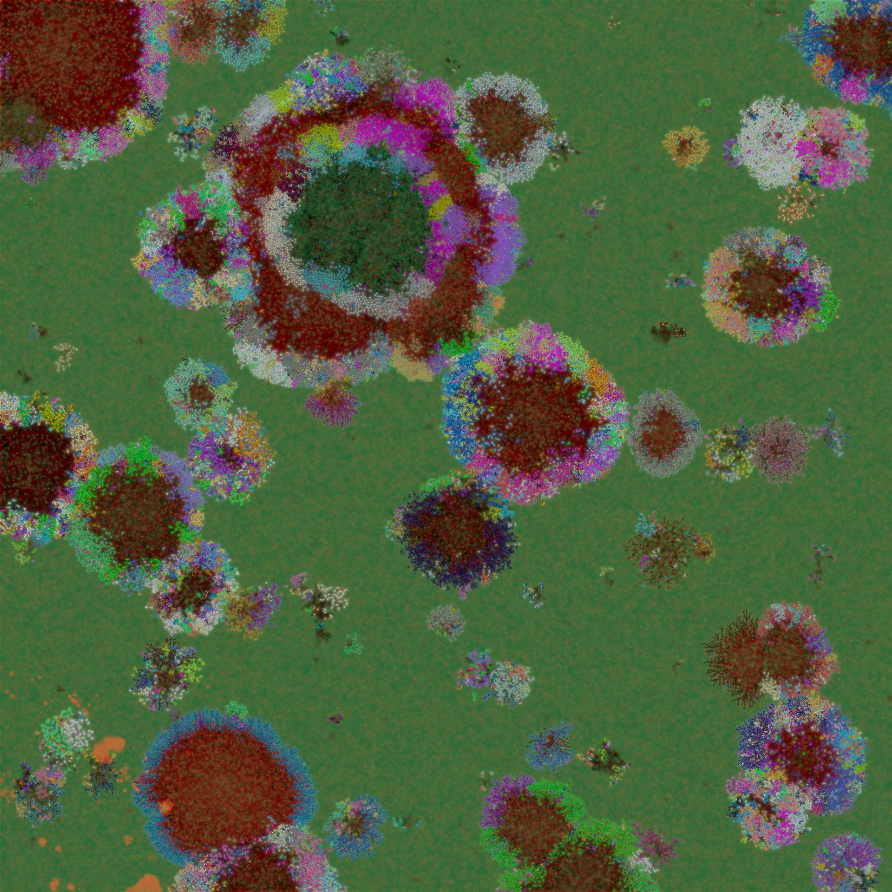
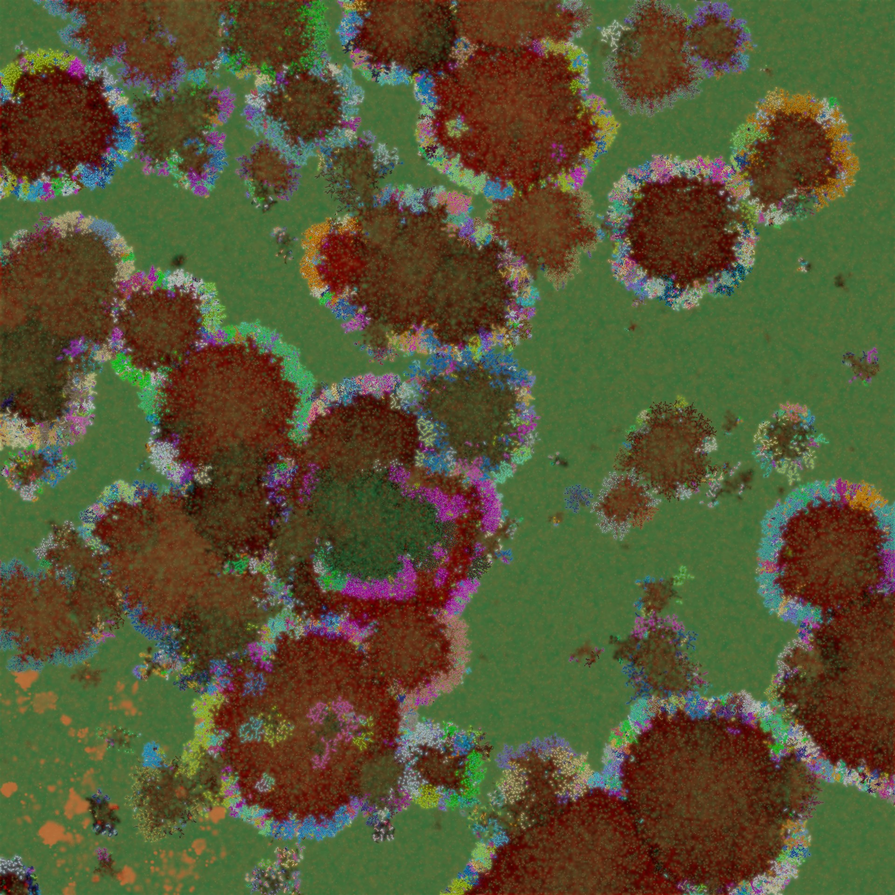

# Ribossome: A GPU-Accelerated Evolution Simulator

[](https://opensource.org/licenses/MIT)

Ribossome is a real-time artificial life simulator I've been developing since 2019, driven by a core hypothesis: if an organism's body *is* its genetic information—if the same sequence directly constructs both the physical structure and the reactive machinery that interprets it—then complex, evolving life will emerge inevitably.

Inspired by RNA-world animations and the self-organizing elegance of early biochemistry, I built a system with deliberately simple rules loosely modeled on nucleotide → codon → amino acid translation (sharing only the names). From these minimal constraints, vibrant ecosystems arise in minutes.

## Core Mechanics

### Genome and Body Unity
Each agent is a linear chain of up to 64 "amino acids" translated directly from a 256-nucleotide RNA-like genome. The sequence defines both static shape (each amino acid adds a preferred bend angle) and dynamic behavior (two propagating signals, alpha and beta, cause segments to bend in proportion to their type).

### Energy and Reproduction
Agents spend energy to maintain their chain and to progressively "pair" their genome. When pairing completes:

- **Asexual mode (default)**: The genome is directly copied to the offspring with mutations—fast, reliable inheritance.
- **Sexual/complementary mode (toggleable)**: A true complementary strand is synthesized (A↔U, G↔C). This produces a completely different sequence that translates into a potentially very different body plan and behavior. For the lineage to persist, this radically altered offspring must survive and reproduce on its own merits. This forces parallel evolution of complementary lineages and creates strong pressure for genomes that are functional in both orientations—mirroring aspects of real double-stranded genetics while remaining far simpler.

### Organs as Combinatorial Machines
Specific promoter + modifier codon pairs produce specialized organs: sensors (local, magnitude, agent-specific), standard/beta/vampire mouths, emitters, clocks, sine generators, chiral flippers, anchors, trail sensors, poison resistance, and more—all encoded in just 6 bases.

### Two Distinct Propulsion Systems

#### Organ-based Propellers
Propeller organs emit a force vector perpendicular to the segment they're attached to. Effective movement and steering require evolved body shapes that align these forces coherently.

#### Microswimming (Hybrid Low-Re / High-Re)
A dedicated mode using resistive force theory for low-Reynolds (viscous) regimes—sideways segment motion meets higher drag than forward, converting undulation into thrust—with a blended vortex bonus at higher Reynolds numbers for burst speed when deformation and mass allow. This enables fast, flagella-like swimming without explicit propellers.

### Environment and Physics
Agents inhabit a large rectangular world (61440×61440 units) with hard reflective boundaries. The environment features diffusible food/poison grids, terrain slopes that drive chemical flow, periodic rain events, and an optional full Navier-Stokes fluid simulation (stable-fluids with advection, projection, and vorticity confinement). Both propulsion methods inject real forces into the fluid, producing prop wash, vortices, and realistic chemical transport.

### Scale and Performance
The entire simulation runs on the GPU via large WGSL compute shaders. On an RTX 5090, it achieves 700+ FPS with 60,000 agents when fluids are disabled, allowing evolutionary dynamics to unfold in real time.

## What Emerges

From random initial genomes, coherent life appears rapidly: graceful microswimmers, propeller-driven cruisers, trail-following predators, vampire energy thieves, symbiotic partnerships, and self-regulating ecosystems. Complementary reproduction adds another layer—lineages must evolve genomes viable in both strands, often leading to paired "species" that alternately dominate or to rapid diversification when one strand proves superior.

Ribossome is more than a toy; it's a controlled demonstration that a body-as-genome paradigm, combined with energy constraints, local physical interactions, and optional complementary inheritance, is sufficient to bootstrap open-ended evolutionary complexity from almost nothing.

## Features

- Fully GPU-driven simulation (agents, physics, environment diffusion, rendering)
- Genetic translation with codons → amino acids → body parts and organs
- Evolving predators with vampire mouths and trail-following
- Dynamic environment with food/poison rain, terrain, prop wash, and chemical slopes
- Rich visualization options (lighting, trails, interpolation modes)
- **Runtime resolution switching** (2048/1024/512) via UI - no restart needed
- Snapshot save/load (PNG with embedded metadata) with cross-resolution compatibility
- Auto-difficulty, rain cycling, and extensive tuning UI
- Open-source (MIT licensed), written in Rust with wgpu and egui
- Rich visualization tools: chemical overlays, agent trails, slope lighting, detailed inspector

**It's proof that life-like evolution needs no elaborate rules—just the right simple ones.**

## Screenshots


*Complex ecosystem with evolved agents competing for resources*


*High-density simulation showing chemical signal propagation and agent interactions*

## Building & Running

Requirements:
- Rust toolchain (stable)
- A GPU with WebGPU support (modern NVIDIA/AMD/Intel, or Vulkan/Metal/DX12)

```bash
git clone https://github.com/Manalokosdev/Ribossome.git
cd ribossome
cargo run --release
```

The first run may take 10–60 seconds due to shader compilation (normal for large WGSL shaders). Subsequent runs are instant.

## Controls

- **WASD**: Pan camera
- **Mouse wheel**: Zoom
- **Right-drag**: Pan
- **Left-click**: Select agent for inspector
- **Space**: Toggle UI
- **F**: Follow selected agent
- **R**: Reset camera

## License

This project is licensed under the MIT License - see the LICENSE file for details.

## Contributing

Contributions are welcome! See CONTRIBUTING.md for guidelines.

## Acknowledgments

Built with Rust, wgpu, egui, and a lot of passion for artificial life.

---

Copyright © 2025 Filipe da Veiga Ventura Alves
